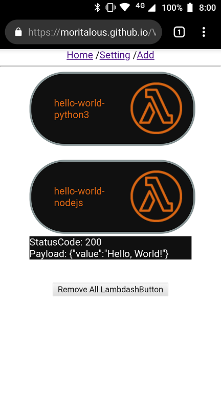

# VLambdashButton (Lambda version of Virtual Dash Button)

https://moritalous.github.io/VLambdashButtonTmp/

## Usage

1. Open `Setting`. Setup AWS credentials and region.
1. Open `Add`. Select Lambda you want to use.
1. Open `Home`. Use Lamdash!

## Limitation
Parameter is only `{}`.

